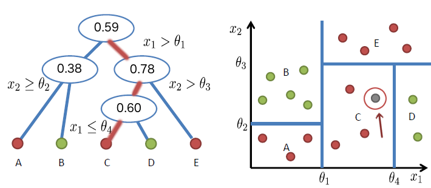

# Prediction explanations

### Why explaining individual predictions

Machine learning models and algorithms often come as black boxes for the end
user. They are good at finding mappings between a set of features and a target,
but they do not really describe the underlying relationship between a given set
of feature and the prediction made by the model.

In many cases, what we would be interested in would be to know not only the
prediction, but also *why* such a prediction has been made by the model, on which
feature the model based it prediction, and what to turn the model output into
something else.

Typical examples could be:

- In fraud detection: why has this person been predicted as a fraudster ?
- In predictive maintenance: why is it supposed to break, and what can we do about it ?
- In pricing prediction: which features tends to lower or increase the price ?

This is going to become a field of major importance soon as the European Union
will impose a right to explanation for citizens: when a decision that concerns
directly an individual will be taken by an algorithm, this person could ask the
decision maker why such a decision has been made. In Machine Learning, this
means for companies to be able to extract explanations automatically even from
black-boxes algorithms.

### How we can do it

What we want is to measure the influence of each feature and extract the most
important ones regarding a specific prediction.

Several methods has been published and are being developped. They can mainly be
classified into model-dependant and model-independant explanation system.

### Model dependant methods

The first solution is to look at how a given model actually works, and try to
extract each feature contribution.

#### Linear models

By definition linear models are the easiest to interpret without an on-top
explanation algorithm: one only has to look at the coefficients to see the
relative importance of each variable.

We can also compute the direct contribution to the outcome: the final
prediction is the sum of the feature value and the regression coefficient, plus
some overall bias. So on a prediction level, multiplying each regression
coefficient by the feature value give the direct influence of the feature value
on the prediction.

Moreover, the coefficient directly gives an idea on how the prediction is going
to evolve when perturbing a feature.

#### Tree-based algorithms

For a decision tree, extracting features contributions means check the path in
the tree to reach a given point.

Each split on the path moves the prediction up or down, and at each split a
single feature is involved. So computing the output difference at each split
will indicate the feature influence for that split. For a given feature, we can
sum up the contributions for all the splits this is feature is involved. Thus,
the output predictions can be written:

*P(y = red | x1, x2) = Global_Bias + ∑ contribution_f(x)*

On the tree example above, we would have:
- contribution from x1: 0.59
- contribution from x2: -0.18
- global bias: 0.59
which means that x1 has a bigger importance in the classification decision of
the grey dot into the red class.

For ensemble methods such as Random Forests and Gradient Boosted Trees, each
feature contribution is simply the average of each decision tree's feature
contribution.

You can find an implementation of this method
[here](https://github.com/andosa/treeinterpreter).

Yet, even if this method is interesting to identify the important features
involved in the prediction, it lacks a sign: it's not possible to know whether
x1 should be increased or decreased to switch the outcome of the prediction.

### Model-independant explanations

The problem that comes with model independant explanations is that they often
can't be compared between each others. Two different models on the same data
would lead to two different kind of explanations that would be difficult to
compare. So having an explainer that would work on every kind of model would be
very useful.

#### Lime

Lime stands for Locally Interpretable Model-agnostic Explanations. It's a local
approximation of a complicated model by a interpretable one, namely a linear
model.

It's based on this article: ["Why Should I Trust You?": Explaining the
Predictions of Any Classifier](https://arxiv.org/abs/1602.04938).

Lime first sample many points around the interesting point, weight each one of
them by a kernel depending of the distance from the original point, and then
fits a linear model between these samples and their predicted value by the
model. So it is a local approximation of the model outcome around the line we
want to explain.

[An implementation](http://github.com/marcotcr/lime) has been made on github by
the author.

Here are several notebooks about lime:

-  
-  
-  

#### Explanation vectors

Another way to locally explain the prediction is to compute the gradient of the
model output arount the point. This is quite similar to lime because the
derivative is a linear approximation of the model output, but instead of
sampling a synthetic dataset, we can recover this model output distribution
with a kernel density estimation. Once the desity is recovered using a gaussian
kernel for instance, it's then easy to compute the gradient which is then
called an *explanation vector*.

Check [this article](http://www.jmlr.org/papers/volume11/baehrens10a/baehrens10a.pdf)
from the journal of ML research.

